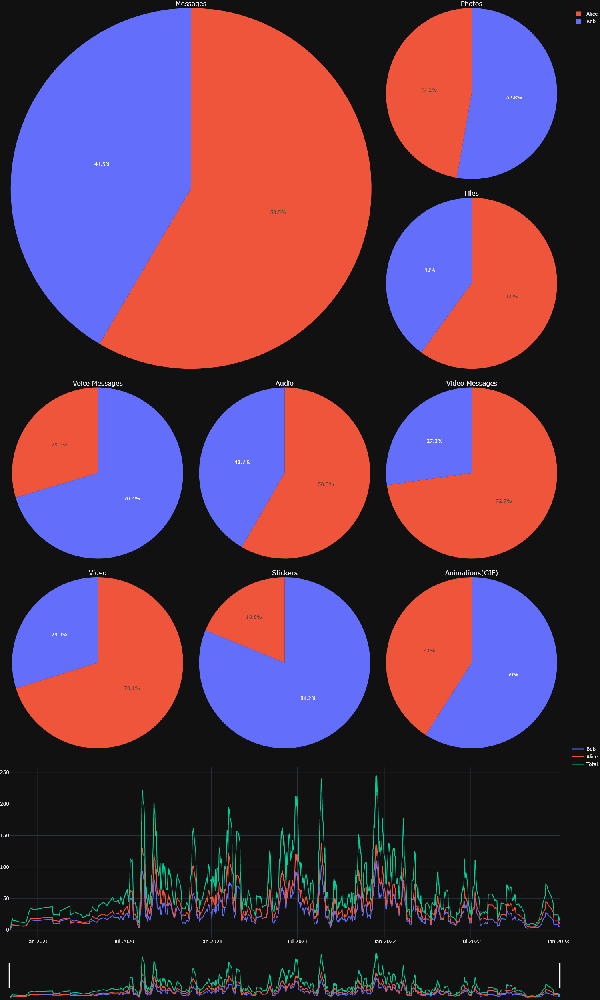

# TelegramVisualizer


This project allows you to create cool and interesting stats and interactive graphs from your Telegram chats.

This works best with private chats and group chats with low members. Currently not tested on channels.

# Installation

```
git clone https://github.com/somso2e/TelegramVisualizer
pip install requirements.txt
```
Pip package coming soon ™️


# How to export chat history in Telegram

1- Open Telegram desktop

2- Go to your desired chat

3- Click the 3 dots menu and hit "Export Chat History"

4- Untick all media for faster download, don't worry this does not affect the stats

5- On the bottom change the format from HTML to "Machine-readable JSON" 

6- Change your desired timeline, by default its from the beginin until now

7- Hit export and wait for it to finish

Example
---
```py
from TelegramVisualizer import TelegramVisualizer

# You can use the example data in the ./data directory for testing
telegram_visualizer = TelegramVisualizer(
    chat_history_path="data/",
)

telegram_visualizer.plot()
telegram_visualizer.save("output.png")
```



